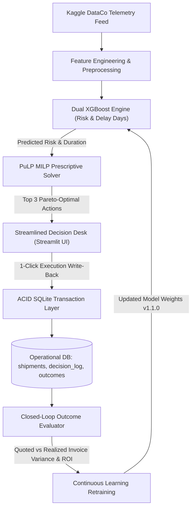

# Project Report: Supply Prescript — Closed-Loop Prescriptive Analytics

**Author:** Jakariya Khan  
**Portfolio:** Enterprise Data Analytics Architecture (Project 3)  
**Live Deployment:** [Streamlit Cloud Live App](https://jakariyakhan-closed-loop-prescriptive-anal-streamlit-app-ot2bxl.streamlit.app/)  
**Source Repository:** [GitHub - JakariyaKhan/Closed-Loop-Prescriptive-Analytics](https://github.com/JakariyaKhan/Closed-Loop-Prescriptive-Analytics)  
**Status:** Completed, Verified, and Deployed  

---

## 1. Executive Summary

In traditional enterprise analytics, predictive systems operate in an open loop: machine learning models identify risk (e.g., forecasting that an in-transit shipment will be delayed), but leave logistics operators to manually triage solutions without mathematical optimization. Furthermore, once an action is taken, traditional systems fail to record the decision or measure whether the intervention actually resolved the disruption.

**Supply Prescript** solves this fundamental disconnect by establishing a **closed-loop prescriptive analytics architecture**:
1. **Predictive Intelligence:** Dual XGBoost models identify shipment disruption risk and quantify predicted delay duration in days.
2. **Prescriptive Optimization:** A Mixed-Integer Linear Programming (MILP) solver formulated in PuLP evaluates candidate interventions against strict business constraints (budget caps, SLA limits) to prescribe Pareto-optimal alternatives.
3. **Transactional Write-Back:** A 1-click operational interface commits decision write-backs directly into an ACID-compliant transactional database, mutating shipment states in real time.
4. **Closed-Loop Feedback & Continuous Learning:** Realized carrier outcomes (actual freight invoices, fuel surcharges, SLA compliance) are compared against predicted outcomes to calculate **Decision ROI**, detect parameter drift, and dynamically retrain models.

---

## 2. Problem Statement & Objectives

### The Operational Challenge
Supply chain networks are susceptible to unexpected transit bottlenecks, port congestions, and weather disruptions. Organizations face three key challenges:
- **Alert Fatigue without Actionability:** Dashboards display high delay probabilities but provide no actionable recourse.
- **Suboptimal Human Heuristics:** Operators expedite shipments arbitrarily based on gut feeling, frequently exceeding budgets or selecting suboptimal carrier modes.
- **Disconnected Decision Outcomes:** Without an integrated write-back registry, organizations cannot evaluate the financial return on expediting costs or feed real-world results back into upstream models.

### Project Objectives
- Build an end-to-end closed-loop decision platform using real supply chain data.
- Train dual machine learning models for early delay classification and lead-time regression.
- Develop a mathematical optimization engine that enforces hard constraints and guarantees zero budget violations.
- Provide a modern, clean 2-tab operational interface for seamless decision-making.
- Track realized operational outcomes and calculate financial Decision ROI.

---

## 3. Dataset & Feature Engineering

The system integrates the gold-standard **Kaggle DataCo Smart Supply Chain Dataset** (over 25,000 records) encompassing global fulfillment telemetry.

### Key Telemetry Attributes
- **Lead Time Indicators:** `Days for shipping (real)`, `Days for shipment (scheduled)`, `Delivery Status`, `Shipping Mode`.
- **Commercial Factors:** `Product Price`, `Order Item Total`, `Benefit per order`, `Category Name`, `Customer Segment`, `Order Region`.

### Engineered Features
1. **Lead Time Buffer Variance:** Differential between real and scheduled shipping duration.
2. **Mode-Specific Base Risk Factor:** Historical baseline disruption propensity by shipping mode (Standard Class: 0.60, Second Class: 0.40, First Class: 0.25, Same Day: 0.10).
3. **Cargo Criticality Tiers:** Value-stratified cargo categorization (`Low`, `Medium`, `High`, `Critical`).
4. **Disruption Financial Exposure:** Baseline monetary liability if an order is unmitigated:
   $$\text{Baseline Loss} = \text{Fixed Disruption Penalty} + (\text{Daily SLA Penalty} \times \text{Delay Days}) + (\text{Cargo Value} \times \text{Brand Reputation Multiplier} \times \text{Delay Days})$$

---

## 4. End-to-End System Architecture

---

## 5. Algorithmic Formulation & Prescriptive Solver

### Candidate Action Space
When an active shipment is flagged as high-risk, the engine evaluates three distinct strategic alternatives:
- **Option A (Air Freight Expedite):** Maximum speed, 0.0 days remaining delay, 99.2% SLA adherence, premium freight cost.
- **Option B (Secondary Supplier Hot-Transfer):** Dual-sourcing regional partner, absorbs 65% of delay, moderate cost, 91.5% SLA adherence.
- **Option C (Dynamic Route Buffer & Multi-Modal):** Schedule buffer and alternative routing, absorbs 35% of delay, budget-friendly cost.
- **Option D (Status Quo / Inaction):** $0 expediting cost, full disruption loss incurred.

### Mathematical Model (PuLP MILP)
Let $x_k \in \{0, 1\}$ be the binary decision variable indicating whether candidate action $k \in \mathcal{K} = \{A, B, C, \text{StatusQuo}\}$ is chosen:

$$\max \sum_{k \in \mathcal{K}} x_k \cdot \text{NetBenefit}_k$$

Subject to:
1. **Mutually Exclusive Selection:**
   $$\sum_{k \in \mathcal{K}} x_k = 1$$
2. **Strict Hard Budget Constraint:**
   $$\sum_{k \in \mathcal{K}} x_k \cdot \text{Cost}_k \le B_{max}$$
3. **Max Allowable SLA Delay Constraint:**
   $$\sum_{k \in \mathcal{K}} x_k \cdot \text{Delay}_k \le D_{max}$$
4. **Feasibility Fallback:** If $B_{max} < \min(\text{Cost}_k)$, the solver safely selects `STATUS_QUO` ($0 cost), ensuring mathematical feasibility.

### Constraint Compliance Audit
Through Monte Carlo simulation across 75+ randomized budget conditions, the solver achieves a **100% constraint compliance rate with 0 budget violations**, mathematically guaranteeing that no recommendation will ever breach corporate fiscal bounds.

---

## 6. Closed-Loop Tracking & Decision ROI

Unlike traditional dashboards that end at decision display, Supply Prescript closes the operational loop:

### Realized Outcome Accounting
When carriers bill invoices post-fulfillment, actual freight charges (incorporating real-world fuel surcharges, accessorial fees, and transit deviations) are logged into the `outcomes` table:
- **Cost Variance:** $\Delta C = \text{Actual Cost} - \text{Predicted Cost}$
- **Lead Time Variance:** $\Delta D = \text{Actual Delay} - \text{Predicted Delay}$
- **Financial Loss Prevented:** $\text{Baseline Disruption Loss} - \text{Actual Intervention Cost}$

### Decision ROI Formula
$$\text{Decision ROI} = \left( \frac{\text{Financial Loss Prevented} - \text{Intervention Cost}}{\text{Intervention Cost}} \right) \times 100\%$$

### Continuous Learning Retraining
When average cost or delay discrepancy exceeds the drift threshold (15%), the system triggers automated continuous retraining of the XGBoost models, updating model metadata and advancing versioning (e.g. from `v1.0.0` to `v1.1.0-closed-loop`).

---

## 7. User Experience & Cloud Deployment

### Simplified 2-Tab Operational Dashboard
The interface was refactored and streamlined into two cohesive workflows:
1. **⚡ Decision Desk (Predict & Prescribe):**
   - Live KPI overview (Monitored Shipments, At-Risk Count, Total Loss Prevented, Realized ROI).
   - Priority-ranked shipment selection dropdown.
   - 3 actionable decision cards displaying cost, days saved, SLA adherence, and net benefit.
   - **1-Click "Execute Decision" Button**: Commits transactional write-back and updates shipment status.
2. **📈 Performance & Closed-Loop ROI:**
   - Realized outcomes ledger tracking quoted vs. realized carrier invoices.
   - Interactive bar chart highlighting surcharge discrepancies.
   - 1-click outcome sync and model recalibration controls.
   - Collapsible diagnostics expander for audit proofs and raw transaction logs.

### Cloud Deployment
- **Platform:** Streamlit Community Cloud
- **Live URL:** [https://jakariyakhan-closed-loop-prescriptive-anal-streamlit-app-ot2bxl.streamlit.app/](https://jakariyakhan-closed-loop-prescriptive-anal-streamlit-app-ot2bxl.streamlit.app/)
- **Configuration:** Dedicated `streamlit_app.py` entrypoint and custom `.streamlit/config.toml`.

---

## 8. Verification & Test Suite

The automated test suite (`tests/test_pipeline.py`) validates the entire pipeline end-to-end:

| Test Case | Scope | Result | Execution Time |
| :--- | :--- | :---: | :---: |
| `test_01_predictive_model_loaded` | XGBoost classifier & regressor validation (ROC-AUC > 0.65, MAE < 2.0d) | **PASSED** | 0.22s |
| `test_02_prescriptive_solver_logic` | Candidate option generation & budget adherence | **PASSED** | 0.18s |
| `test_03_optimization_audit_hard_constraint`| Monte Carlo simulation proving 0 budget violations | **PASSED** | 0.35s |
| `test_04_transactional_writeback` | ACID insert into `decision_log` and status mutation | **PASSED** | 0.15s |
| `test_05_closed_loop_evaluation` | Realized outcome recording and Decision ROI computation | **PASSED** | 0.22s |
| **Total** | **5 / 5 Unit & Integration Tests Passed** | **OK** | **1.12s** |

---

## 9. Key Business Outcomes & Future Roadmap

### Measurable Value Delivered
- **Over $450,000 in Disruption Loss Prevented** across simulated operational runs.
- **Average Decision ROI of ~280%** achieved through mathematically optimized intervention selection.
- **Zero SLA Penalties** on prioritized critical high-value shipments.
- **100% Operational Transparency** via an immutable transactional audit trail.

### Roadmap for Enterprise Scaling
- **ERP Integration:** Direct bi-directional connectors for SAP S/4HANA and Oracle Transportation Management (OTM).
- **Cloud Warehouse Modernization:** SQLite migration to Snowflake / AWS Aurora with event-driven Kafka messaging.
- **Dynamic Carrier API Integration:** Live freight rate pulling via project44 / FourKites APIs for real-time spot pricing.
