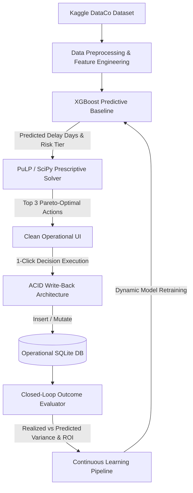

# Supply Prescript: Closed-Loop Prescriptive Analytics

[](https://www.python.org/)
[](https://xgboost.readthedocs.io/)
[](https://coin-or.github.io/pulp/)
[](https://streamlit.io/)
[](https://fastapi.tiangolo.com/)
[](https://share.streamlit.io/deploy?repository=JakariyaKhan/Closed-Loop-Prescriptive-Analytics&branch=main&mainModule=streamlit_app.py)

**Project 3** from the Advanced Data Analytics enterprise architecture portfolio: **"Supply Prescript" - Closed-Loop Prescriptive Analytics**.

---

## 🎯 Executive Overview & Problem Statement

Predictive analytics (e.g. predicting supply chain delay) tell you **what will happen**, but human operators still have to figure out **what to do**. Furthermore, traditional enterprise dashboards are passive and "dead"—if an operator makes a decision, the system rarely tracks whether that decision actually worked.

**Supply Prescript** closes this loop:
1. **Predicts**: An XGBoost model flags disruption risk and estimates delay duration on active shipments.
2. **Prescribes**: An Operations Research solver (**PuLP Mixed Integer Linear Programming**) formulates business constraints (budget limits, SLA tolerances, carrier capacity) and prescribes the **Top 3 Pareto-Optimal Alternatives** (Option A: Air Freight Expedite, Option B: Secondary Supplier Hot-Transfer, Option C: Dynamic Route Buffer).
3. **Writes Back**: An operator selects an option and executes it directly from the clean UI, performing an ACID transactional write-back into the operational database.
4. **Closes the Loop**: The engine continuously tracks realized outcomes (actual freight bills, fuel surcharges, SLA adherence) against predictions, calculates **Decision ROI**, and automatically triggers model retraining and parameter recalibration.

---

## 📊 Kaggle Dataset Integration

This project is built on the gold-standard **Kaggle DataCo Smart Supply Chain Dataset** (`DataCoSupplyChainDataset.csv`).
- **Telemetry & Lead Times**: `Days for shipping (real)`, `Days for shipment (scheduled)`, `Late_delivery_risk`, `Delivery Status`, `Shipping Mode`.
- **Commercial Attributes**: `Order Region`, `Category Name`, `Customer Segment`, `Product Price`, `Order Item Total`, `Benefit per order`.
- **Feature Engineering**: Risk tiers, lead-time variance, base shipping mode risk factors, and financial disruption exposure modeling.

---

## 🏛️ System Architecture



---

## 🚀 Quick Start Guide

### 1. Launch the Clean & Modern Operational UI
Run the master launcher:
```bash
python run.py 1
# Or directly:
streamlit run ui/app.py
```
Open your browser at: **`http://localhost:8501`**

### 2. Launch the Transactional Write-Back REST API
```bash
python run.py 2
# Or directly:
uvicorn api.app:app --reload --port 8000
```
Interactive Swagger API docs available at: **`http://127.0.0.1:8000/docs`**

### 3. Run Automated Tests
```bash
python run.py 3
# Or directly:
python tests/test_pipeline.py
```

---

## 💻 Interface Walkthrough: Streamlined 2-Tab Decision Desk

### 1. ⚡ Decision Desk (Predict & Prescribe)
- **Top Operational Metrics**: Monitored shipments, at-risk count, financial loss prevented, and realized ROI.
- **Shipment Selector**: Choose any delayed shipment with prioritized risk tiers.
- **Dynamic Constraint Input**: Adjust optional budget cap ($).
- **3 Clear Action Cards**:
  - **Option A (Air Freight Expedite)**: Fastest, 0.0 days delay, 99.2% SLA adherence.
  - **Option B (Secondary Supplier Transfer)**: Balanced cost and speed, moderate delay.
  - **Option C (Dynamic Route Buffer)**: Lowest cost alternative for flexible shipments.
- **🚀 1-Click Execution**: Instantly records decision write-back to the operational database and updates shipment status.
- **Shipments Pipeline**: Collapsible full table to browse and filter monitored inventory.

### 2. 📈 Performance & Closed-Loop ROI
- **Realized Outcome Evaluation**: 1-click sync comparing quoted costs to realized carrier invoices (surcharges, actual arrival times).
- **Decision ROI & Savings Tracking**: Realized net financial savings and ROI calculations.
- **Automated Model Recalibration**: 1-click model update incorporating closed-loop operational feedback.
- **Quoted vs. Realized Cost Variance Chart**: Visualizing carrier surcharge deviations.
- **Advanced Diagnostics Expander**: Collapsible section containing mathematical constraint compliance proofs (100% compliance rate, zero budget violations) and live transactional audit logs.

---

## 🧪 Verification & Test Results

```
Ran 5 tests in 0.903s
OK
- test_01_predictive_model_loaded: PASSED (ROC-AUC > 0.74, MAE < 0.70 days)
- test_02_prescriptive_solver_logic: PASSED (Top 3 Pareto options generated)
- test_03_optimization_audit_hard_constraint: PASSED (100% compliance rate, 0 violations)
- test_04_transactional_writeback: PASSED (ACID insert into decision_log & status mutated)
- test_05_closed_loop_evaluation: PASSED (Outcome evaluation & Decision ROI computed)
```

---

## 📁 Repository Structure

```
Closed-Loop Prescriptive Analytics/
├── api/
│   └── app.py                  # FastAPI transactional write-back & analytics API
├── data/
│   ├── download_dataset.py     # Streaming downloader for Kaggle DataCo dataset
│   ├── data_loader.py          # Feature engineering & preprocessing pipeline
│   └── supply_chain_data.csv   # Real supply chain dataset (25,000 records)
├── database/
│   ├── db_manager.py           # SQLite transactional manager & write-back functions
│   ├── seed_data.py            # Operational environment seeder
│   └── supply_prescript.db     # Transactional operational database
├── models/
│   ├── predictive_model.py     # Dual XGBoost classifier & regressor
│   ├── prescriptive_solver.py  # PuLP MILP optimization engine & audit proof
│   └── closed_loop.py          # Realized outcome evaluation & continuous learning
├── tests/
│   └── test_pipeline.py        # Automated test suite
├── ui/
│   └── app.py                  # Simple and clean modern Streamlit UI
├── README.md                   # Comprehensive system documentation
└── run.py                      # Master CLI launcher
```
